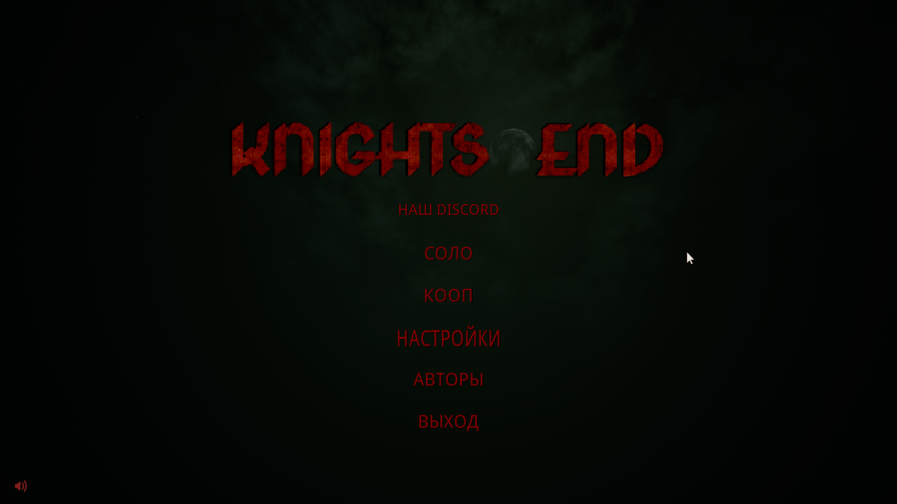
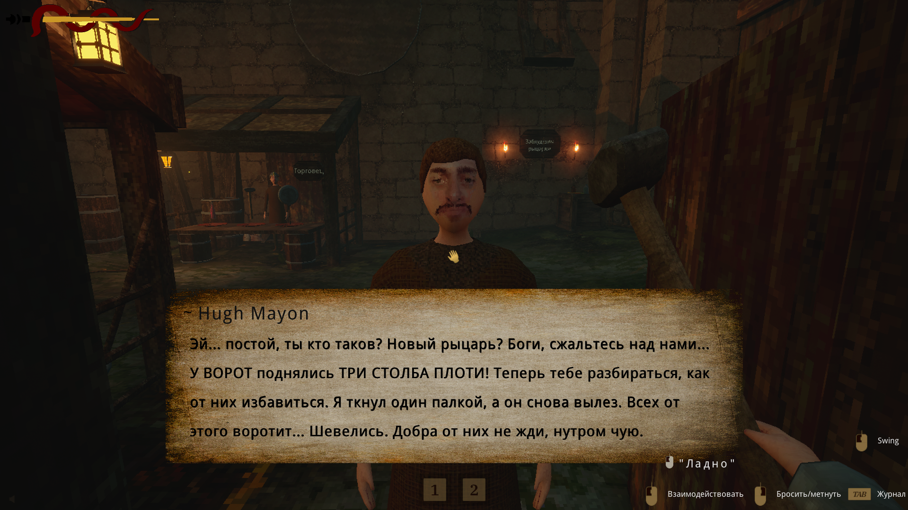
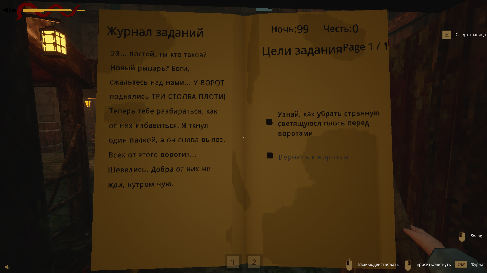
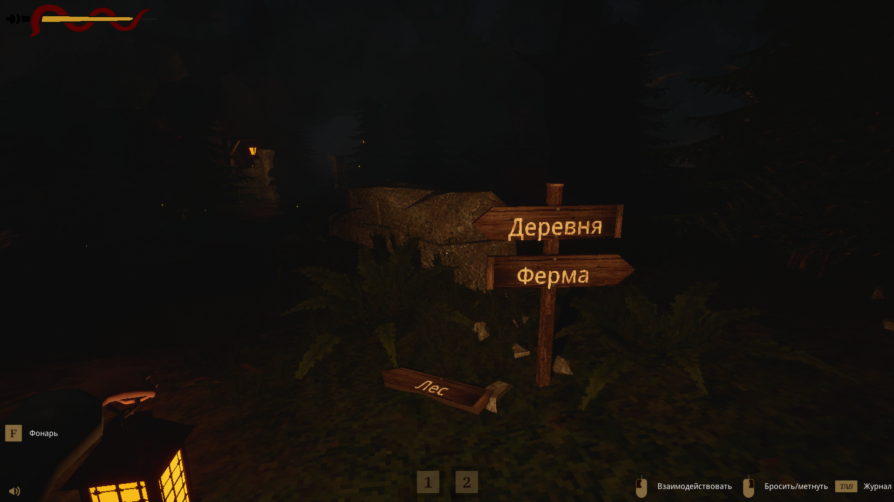
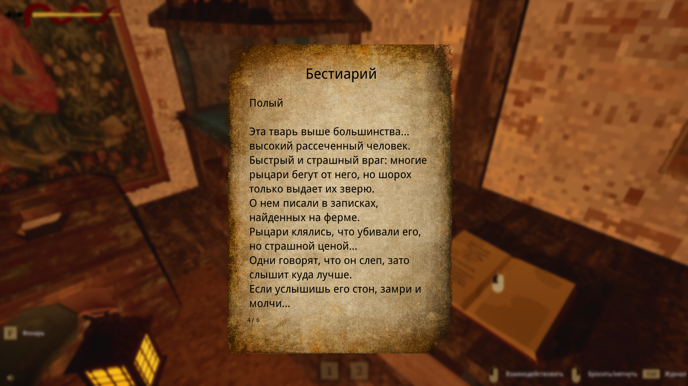

# Knights End RU

Русификатор текста для **Knights End**.

[Скачать для последней версии v2.3.0 (new)](https://github.com/TenCaD/knights-end-ru/releases/download/%D0%A0%D1%83%D1%81%D0%B8%D1%84%D0%B8%D0%BA%D0%B0%D1%82%D0%BE%D1%80/KnightsEnd_RU_patch_v2.3.0_new1.zip)

[Скачать для версии v27.04.2025](https://github.com/TenCaD/knights-end-ru/releases/download/%D0%A0%D1%83%D1%81%D0%B8%D1%84%D0%B8%D0%BA%D0%B0%D1%82%D0%BE%D1%80/KnightsEnd_RU_patch_v27.04.2025.zip)

Проект переводит меню, интерфейс, задания, диалоги, записки, бестиарий, имена и внутриигровые таблички. Стиль сохранён под рыцарский дарк-хоррор: грязные деревни, честь как валюта, ночная стража, плоть, порча и грубоватая средневековая интонация.

## Установка

1. Закрой игру.
2. Скачай `KnightsEnd_RU_patch.zip` под подходящую версию игры.
3. Распакуй содержимое архива в папку игры, где лежит папка `KnightsEnd`.
4. Согласись на замену файлов, если Windows спросит (не должен).
5. Запусти игру.


## Скриншоты

### Главное меню



### Диалоги



### Журнал заданий



### Таблички



### Бестиарий




Внутри архива такая структура:

```text
KnightsEnd/
  Content/
    Paks/
      KnightsEnd-Windows_P.pak
      KnightsEnd-Windows_P.ucas
      KnightsEnd-Windows_P.utoc
README_RU.txt
```

## Что переведено

- Главное меню и настройки.
- Интерфейс, подсказки и журнал заданий.
- Квесты и цели заданий.
- Диалоги NPC.
- Записки, книги и обучающие тексты.
- Бестиарий.
- Имена и прозвища.
- Внутриигровые деревянные таблички.

## Для переводчиков и моддеров

В репозитории лежат не только готовые тексты, но и инструменты, которыми собирался патч:

- `translations/knights_end_ru.tsv` - основная таблица перевода.
- `tools/` - скрипты извлечения, применения перевода и сборки UE5 IoStore-патча.
- `docs/BUILD.md` - инструкция по локальной пересборке.

Оригинальные ассеты игры, распакованные `.uasset/.uexp`, `.pak/.ucas/.utoc`, сторонние `.exe/.dll` и рабочие дампы в git не добавляются. Для сборки нужна легальная копия игры и совместимый `retoc.exe`.

## Статус

- Переведено: `1032` строки.
- Ассеты в патче: `100`.
- Таблички: `88` строк.

## Удаление

Удали файлы патча:

```text
KnightsEnd\Content\Paks\KnightsEnd-Windows_P.pak
KnightsEnd\Content\Paks\KnightsEnd-Windows_P.ucas
KnightsEnd\Content\Paks\KnightsEnd-Windows_P.utoc
```

## Герась

В память о Герасе. Покойся, брат.
